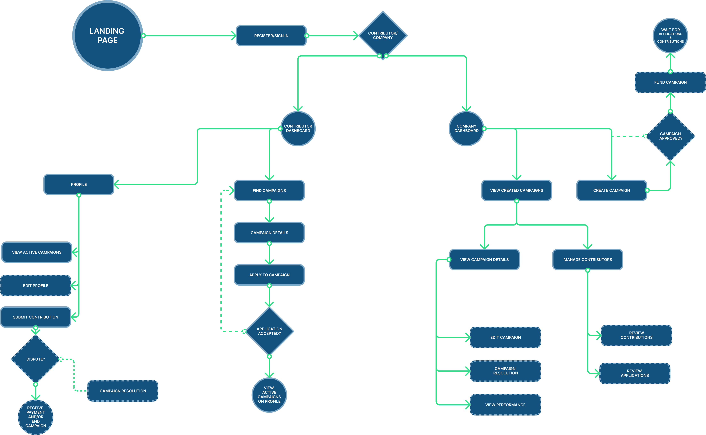

# 

Covariance - a new way to Go-To-Market. It’s called Network-to-Market (or Contributor-To-Market).
Traditional SaaS companies build their B2B or B2C GTM based of their own in house sales, growth and BD teams.

In the age of community-first growth - Covariance is helping companies achieve their goals by empowering a network of highly vetted and skilled web3 contributors to assist and get rewarded for the value created.

## Documenting the Process
We each worked on separate parts of this project: product spec, designs, UI & smart contracts.
Here are some links that show our process and original goals:

- [Hackathon presentation](https://docs.google.com/presentation/d/11zSa06_eEz2Bevu6-YNWmRiRgMB3SBeLBIPxyN-vA3M/edit?usp=sharing) — high-level overview of Covariance ETHOnline hackathon project
- [Figma prototype link](https://www.figma.com/proto/GPbUGb7BOuYrvOVnmPcw8M/Covariance?type=design&node-id=971-2923&t=tp4LOrKeaGo8VOIr-0&scaling=min-zoom&page-id=19%3A83&starting-point-node-id=971%3A2923) — figma prototype showing complete flow
- [Smart contracts overview](https://www.notion.so/Covariance-Contracts-ad6d9136272c417bbf6e36263e1fa814?pvs=4) — high level overview of the Covariance contracts and how to use them (they're permissionless)
- [`CovarianceHub` on Etherscan](https://goerli.etherscan.io/address/0x650f12C2E55a156EDc5730A33059958aE35266b6#code) — a verfied contract on Etherscan with full functionality
- [`CovarianceSafePlugin` on Etherscan](https://goerli.etherscan.io/address/0x3895DDff1DAecC924c33645dd727f830D426b2E6#code) — a verfied contract on Etherscan with full functionality
- [Project draft spec](https://docs.google.com/document/d/1h7WGqZV5uGK5V5Qzj79U0VY5xi_jkTj639BAdX78Id0/edit) — initial spec for hackathon idea

## 📝 Protocol Overview

<a href="./blob/main/user-flow.jpg">

</a>

Companies who want to solicit experts for one-time contributions need to set up
a company Safe account that will hold the funds to finance these contributions.
The Safe account needs to approve the "Plugins" module and enable the Covariance
plugin using the Plugins demo app.

Plugins module:

https://app.safe.global/share/safe-app?appUrl=https%3A%2F%2F5afe.github.io%2Fsafe-core-protocol-demo&chain=gor

Once the Safe account is set up, the company can create a "Campaign". The
campaign lists all the available challenges and their reward.

Once a campaign is open, contributors can apply to participate. The company
approves the participants they'd like to participate and starts the campaign.
Contributors submit their contributions and wait for approvals.

The company goes over every contribution and approves the ones that complied
with the requirements. Once it's approved, an assertion is made on the UMA
Optimistic oracle:

https://testnet.oracle.uma.xyz/

If no one disputes the assertion on the Optimistic Oracle, it is considered
approved, and the contributor can "settle" the claim. As part of the settlement,
the Optimistic Oracle invokes the Covariance Safe Plugin which in turn transfers
the reward from the company's Safe account to the contributor.


## 📦 Setup

### Contracts

#### Architecture

<a href="./blob/main/contracts/architecture.png">

</a>

#### Config
Add a `contracts/.env` file and set the following vars:
```env
GOERLI_RPC=[rpc url]
DEPLOYER=[address for Cast wallet]
ETH_KEYSTORE_ACCOUNT=[name of Cast wallet]
ETHERSCAN_API_KEY=[Etherscan API key]
```

For running tests you only need the `GOERLI_RPC` config.

#### Running tests
This project is using Foundry. To run the tests, we use the `forge` command:
```console
$ forge test -vv
```

#### Deploying contracts
To deploy contracts you must first create a Cast wallet:
```console
$ cast wallet new ~/.foundry/keystores
```

Copy the address of the new wallet and set it in the `DEPLOYER` environment
variable.

Rename the wallet file to something nicer:
```console
$ mv ~/.foundry/keystores/0123-4567-89ab-cdef ~/.foundry/keystores/covariance 
```

Then save the wallet name in the `.env` file, e.g.
`ETH_KEYSTORE_ACCOUNT=covariance`.

Now you can deploy the contracts using the deployment script (make sure to fund
the wallet with goETH first):
```console
$ forge script --broadcast CovarianceHubScript
```

It's recommended to perform a dry-run first (omit the `--broadcast` arg).

---

## Frontend


#### Link to the dapp: [Covariance](https://covariance-ethonline2023.vercel.app/)

### How to run frontend on the localhost:

 - move into `frontend` dir
```console
cd frontend 

npm install

npm run dev
```

- type `http://localhost:3000/` on the browser to view the app locally

---
