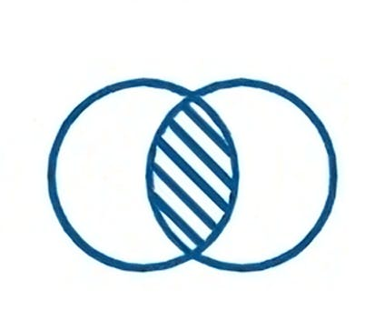
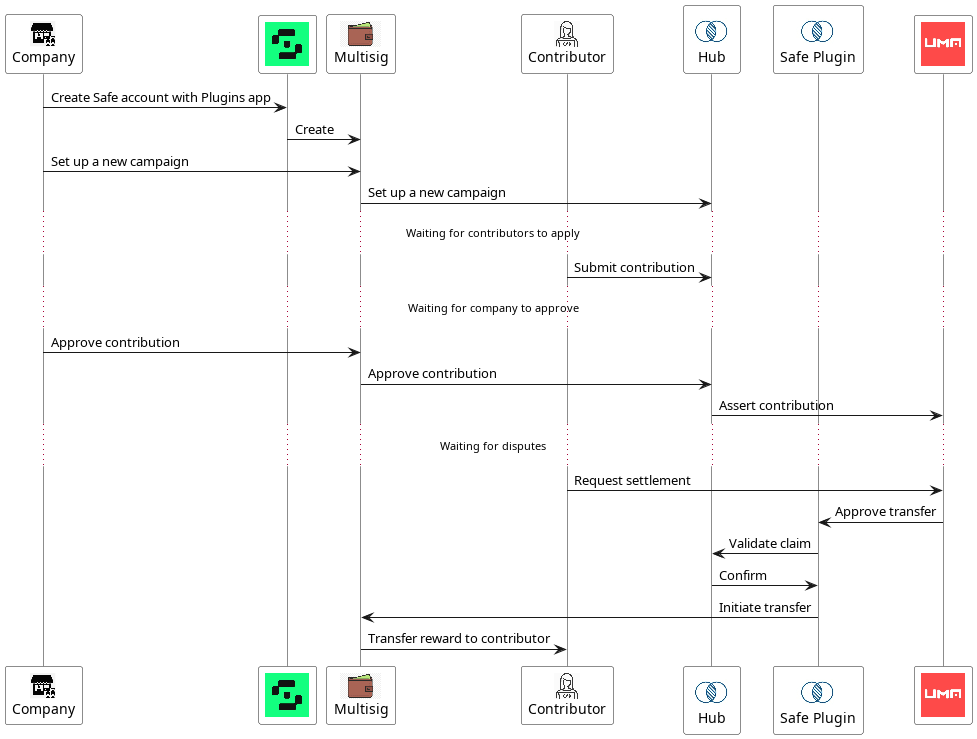

#  Covariance ETHOnline 2023

Covariance - a new way to Go-To-Market. It’s called Network-to-Market (or Contributor-To-Market).
Traditional SaaS companies build their B2B or B2C GTM based of their own in house sales, growth and BD teams.

In the age of community-first growth - Covariance is helping companies achieve their goals by empowering a network of highly vetted and skilled web3 contributors to assist and get rewarded for the value created.

## 📝 Overview

TBD

## 📦 Setup

### Contracts

#### Architecture

#### Config
Add a `contracts/.env` file and set the `GOERLI_RPC` to your RPC url.

### Frontend

TBD

## ❓ How To

TBD
